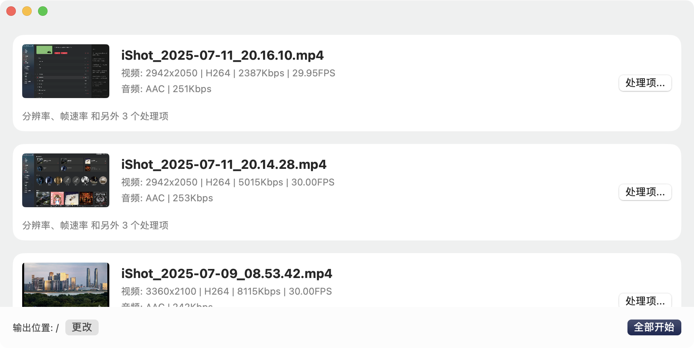
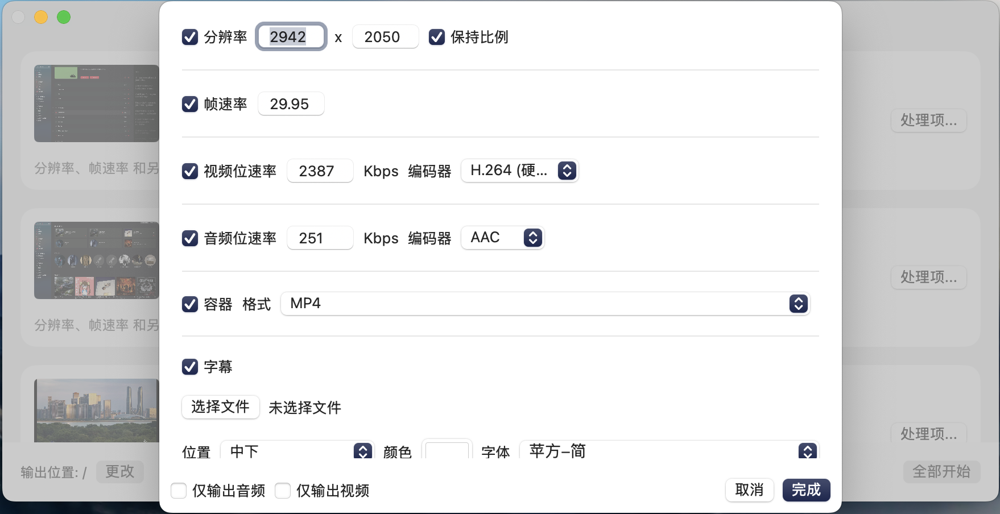
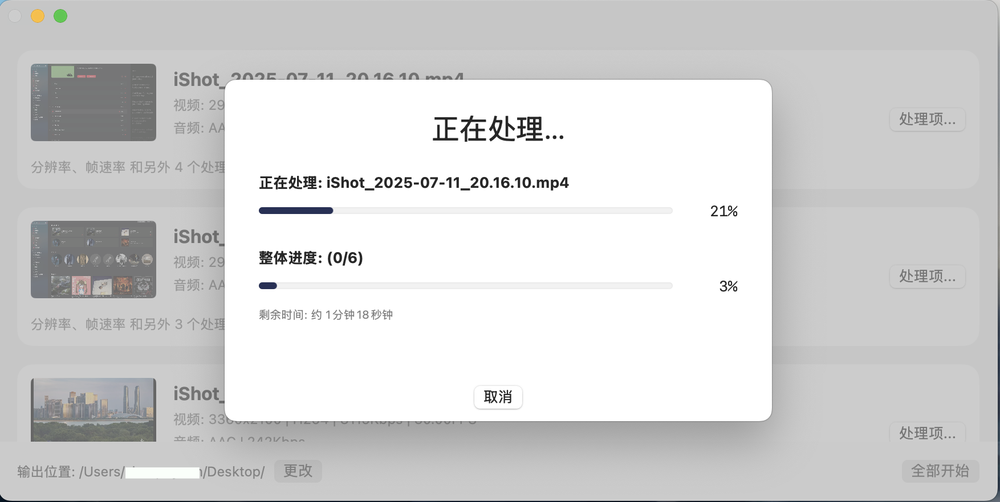

# Media Processor

一个基于 FFmpeg 的综合视频转换/处理工具，基于 Swift 和 SwiftUI 构建，专为 macOS 设计。

本应用旨在简化 FFmpeg 的复杂命令行操作，通过直观的用户界面，让视频处理变得轻松快捷。

## ✨ 特点

- **简洁设计:** 采用现代化的 SwiftUI 界面，界面简洁，对新手友好
- **内置 FFmpeg: **无需额外安装即可运行
- **全新的操作逻辑:** 比同类别的软件用起来更顺手（至少我自己这么觉得）

## 📸 截图






## 🖥️ 系统要求

- macOS 13 或更高版本

## 🚀 如何使用

### 选项 1: 下载发行版 (小白请选择这个方式)

直接从本项目的 [Releases 页面](https://github.com/sbywd/Media-Processor/releases)下载最新的已编译版本。

### 选项 2: 从源码构建

1. **克隆仓库**
   ```bash
   git clone https://github.com/your-username/media-processor.git
   cd media-processor
   ```

2. **下载 FFmpeg**

   将 FFmpeg 与 FFprobe 的 Mac 版可执行文件放在与 Media Processor.xcodeproj 同级的目录中。

   可在[此处](https://www.osxexperts.net/)下载 Apple Silicon 版本的 FFmpeg 和 FFprobe。

3. **打开项目**
   使用 Xcode 打开 `Media Processor.xcodeproj` 文件。

4. **构建并运行**
   选择 `ffmpegui` scheme，然后点击 "Run" 按钮 (▶️)。

## 🛠️ 内置组件

本项目已在根目录中包含了 `ffmpeg` 和 `ffprobe` 的可执行文件。您无需手动安装这些依赖。

## 📢 说明

* 有的时候进度条会卡在 99% 不动了，其实此时视频已经处理好了，耐心等待或直接退出软件即可。
* 本项目不会有 Windows 版本，如果你需要一个好用的 Windows 端视频处理工具，可以试试[这个项目](https://github.com/Lake1059/FFmpegFreeUI)。

## 🙏 致谢

- 本项目依赖于强大的 [FFmpeg](https://ffmpeg.org/)。